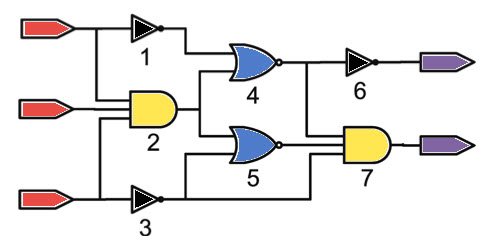
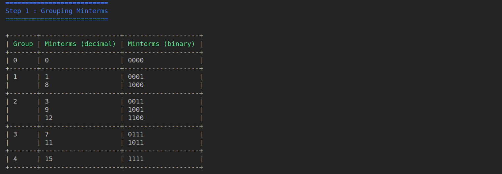
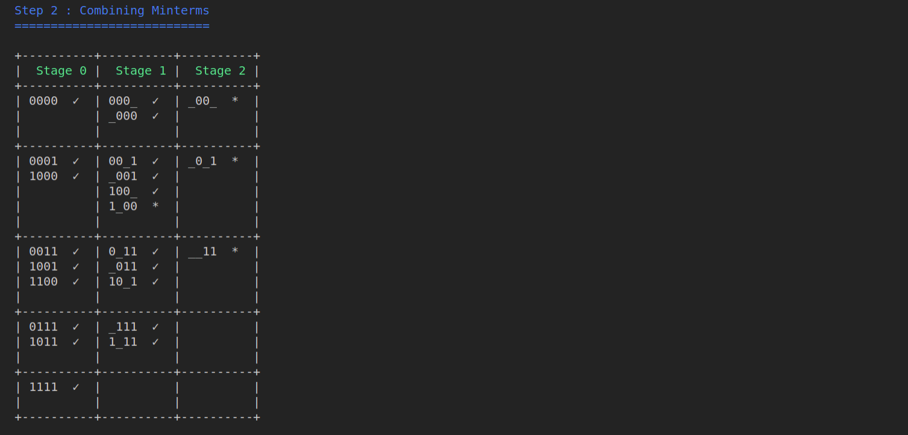
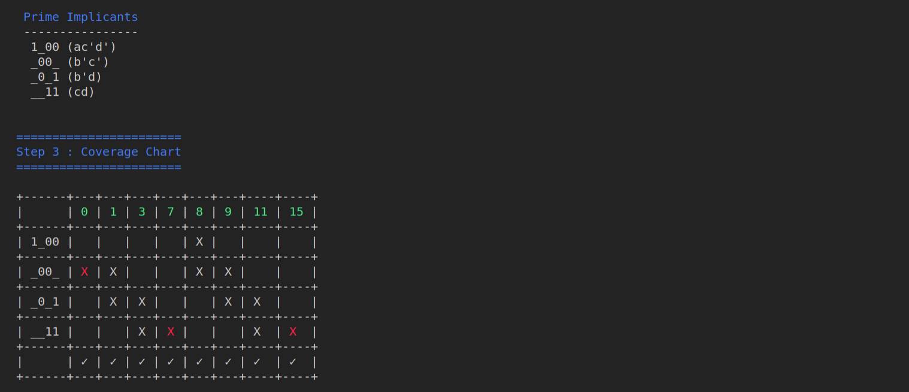
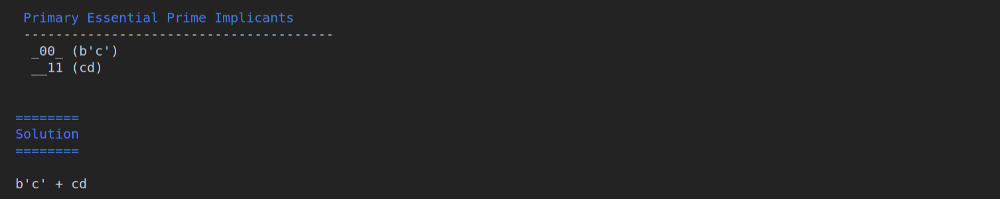

<p align="center">
	
</p>

<h1 align="center">
    Quine McCluskey Circuit Minimizer.
</h1>
  <p align="center">
 
 
 
 
 
 
 
 </p>

An incredibly efficient, lightning-fast, and incredibly user-friendly command-line interface (CLI) tool for circuit reduction using the Quine McCluskey algorithm.

## Usage :computer:
You can use the following optional arguments according to your needs: 

   * `-d`, `--dcares` (list of numbers): **list of dont't cares (default=[ ])**
   * `-v`, `--variables` (list of chars): **list of characters for representing result (default = [ ])**
   * `-s`, `--show_steps` (yes|no): **show steps leading to solution (default=yes)**
   * `-p`, `--show_step` (sum of products): **sum of products are used to be reduce the function**
   * `-m`, `--show_step` (minterms): **sum of minterms are used to be reduce the function**
   
Example
```bash
    python -m qmccluskey -m 0,1,3,7,8,9,11,15 -d 12  -v a,b,c,d
    python -m qmccluskey -p a'b'c'+b'cd'+a'bcd'+ab'c' -v a,b,c,d
```
## Demo :movie_camera:
   Solution for the the Example above
   
   
   
   
   

MIT &copy; Smarak Patra
